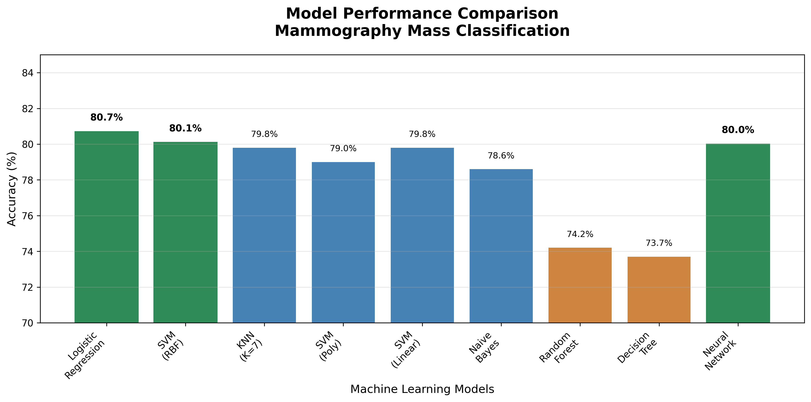
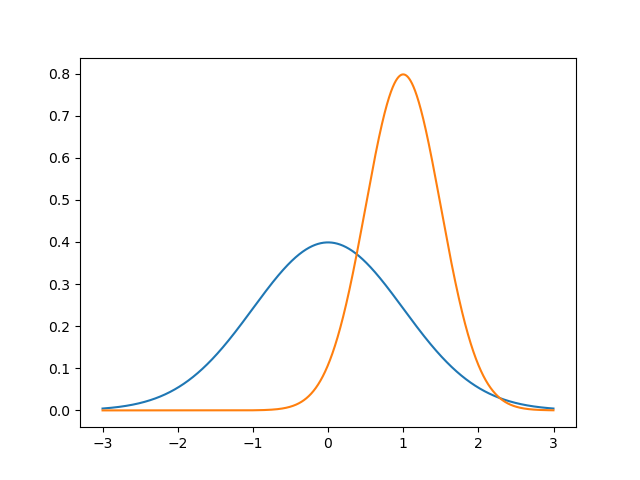
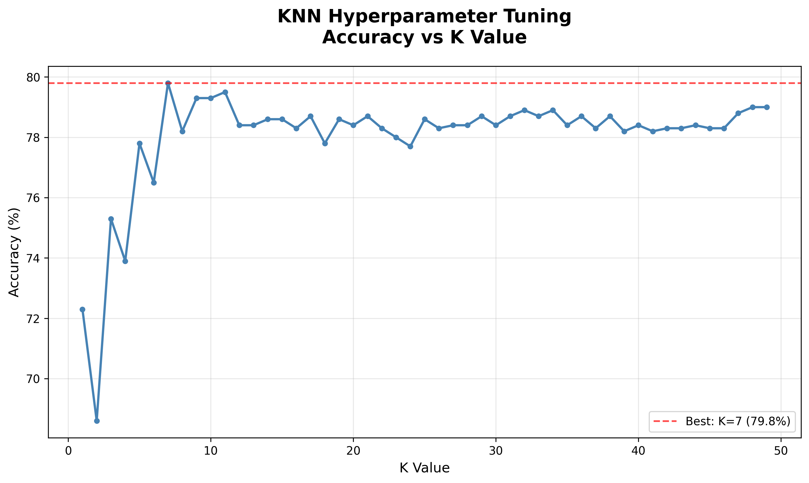
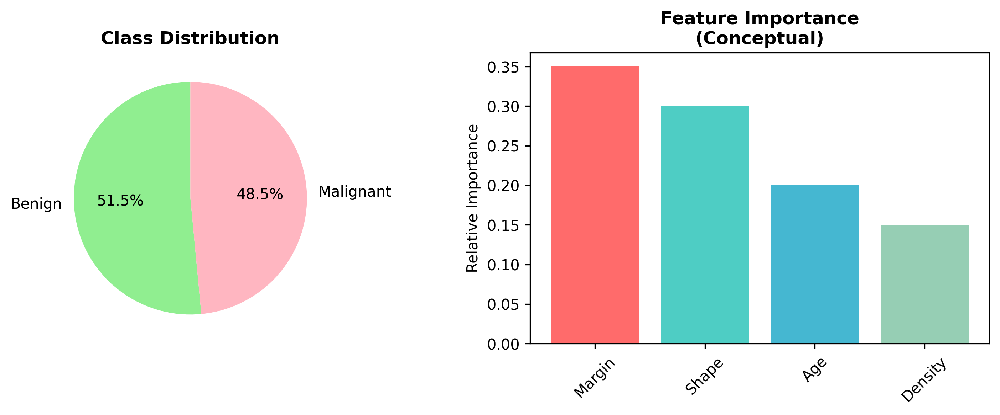

# Mammography Mass Classification


Machine learning project predicting whether mammogram masses are benign or malignant using multiple classification algorithms.

## Problem Statement

Mammography screening generates many false positives, leading to unnecessary anxiety and medical procedures. This project explores machine learning approaches to improve mammogram mass classification accuracy, potentially reducing false positives while maintaining sensitivity for malignant cases.

## Impact & Purpose

This project aims to:
- **Reduce Healthcare Costs** - Minimize unnecessary biopsies and follow-up procedures
- **Improve Patient Experience** - Decrease anxiety from false positive results
- **Assist Medical Professionals** - Provide data-driven insights for radiologists
- **Advance Medical AI** - Demonstrate effective ML techniques for medical imaging classification

## Dataset

**Source**: [UCI Machine Learning Repository - Mammographic Mass Data Set](https://archive.ics.uci.edu/ml/datasets/Mammographic+Mass)  
**Size**: 830 instances (after cleaning)  
**Features**: Age, Shape, Margin, Density  
**Target**: Binary classification (benign=0, malignant=1)

## Methodology

- **Preprocessing**: Removed missing data, applied feature scaling
- **Validation**: 10-fold cross-validation
- **Algorithms**: Decision Tree, Random Forest, SVM (multiple kernels), KNN, Naive Bayes, Logistic Regression, Neural Network

## Results



| Algorithm | Accuracy |
|-----------|----------|
| **Logistic Regression** | **80.7%** |
| **SVM (RBF kernel)** | **80.1%** |
| **KNN (K=7)** | **79.8%** |
| **SVM (Polynomial)** | 79.0% |
| **SVM (Linear)** | 79.8% |
| **Naive Bayes** | 78.6% |
| **Random Forest** | 74.2% |
| **Decision Tree** | 73.7% |
| **Neural Network** | ~80% |

### Performance Visualization


## Key Findings

- **Logistic Regression** achieved best performance (80.7%)
- **Hyperparameter tuning** significantly impacts results (KNN: 68.6% to 79.8%)
- **Simple models** often outperform complex ensemble methods

### KNN Hyperparameter Optimization


### Dataset Overview


## Usage

```bash
# Clone and setup
git clone <repository-url>
cd mammography-classification
pip install pandas numpy scikit-learn matplotlib tensorflow
```

## Requirements

- pandas, numpy, scikit-learn
- matplotlib, seaborn
- tensorflow/keras
- pydotplus

## Contributing

Contributions are welcome! Please feel free to submit a Pull Request.

1. Fork the project
2. Create your feature branch (`git checkout -b feature/AmazingFeature`)
3. Commit your changes (`git commit -m 'Add some AmazingFeature'`)
4. Push to the branch (`git push origin feature/AmazingFeature`)
5. Open a Pull Request


## Citation

If you use this dataset or code in your research, please cite:

```bibtex
@article{elter2007prediction,
  title={The prediction of breast cancer in mammography: using the BI-RADS attributes to suggest an appropriate intention to treat},
  author={Elter, Mathias and Schulz-Wendtland, R{\"u}diger and Wittenberg, Thomas},
  journal={Medical physics},
  volume={34},
  number={11},
  pages={4464--4473},
  year={2007},
  publisher={American Association of Physicists in Medicine}
}
```